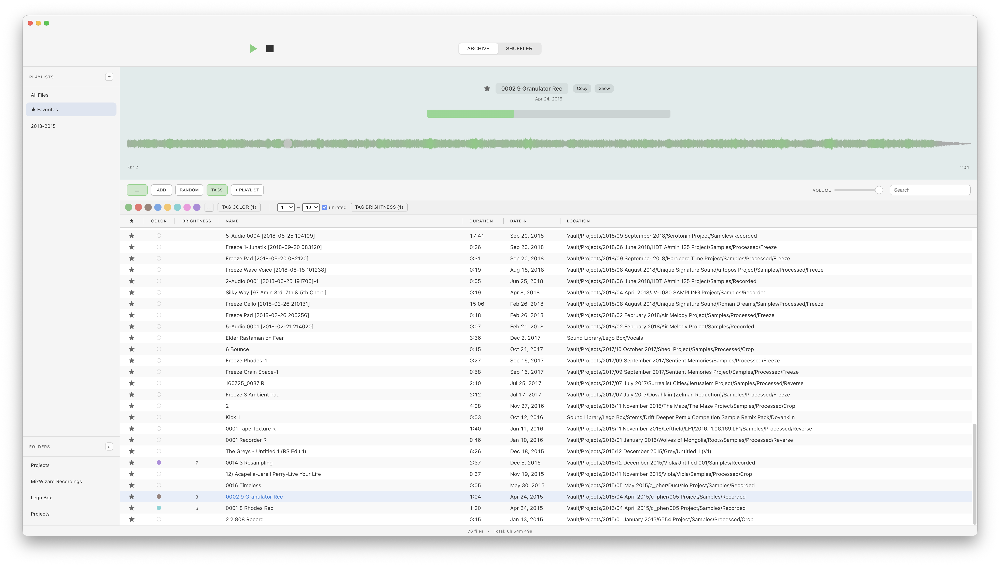
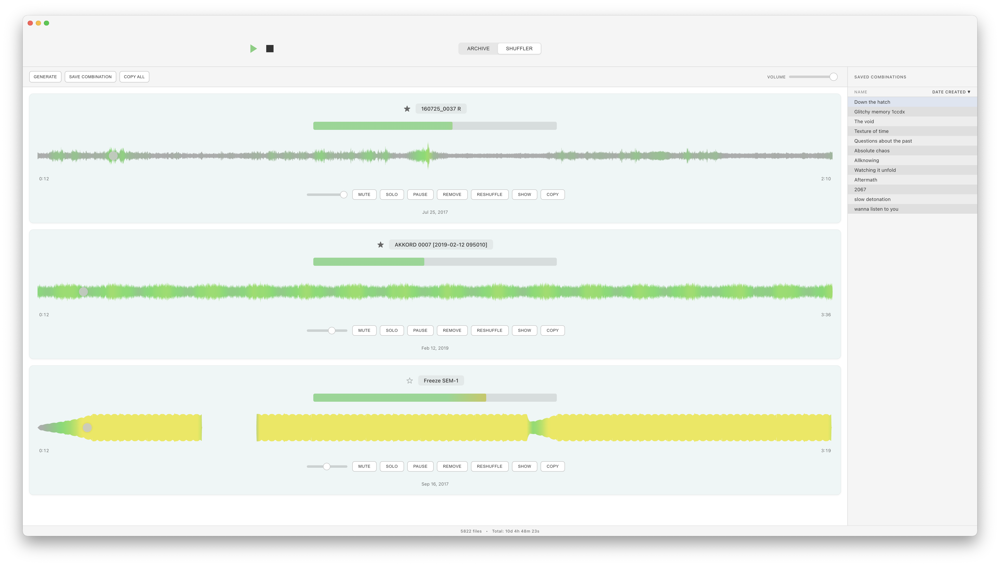

# Active Archive

This audio archive and shuffler application is inspired by Brian Eno and Peter Chilvers. I got the idea from seeing Brian Eno demonstrate it in a video interview with Zane Lowe on the Apple Music channel and have been obsessed with it ever since. 

For almost a year I have been working on it on and off in collaboration with Claude Code. I am not a coder and thus I am grateful we live in a time where we can build out our own fantasies. There is obviously much to worry about and lament regarding music, arts and humanity in general but I set out to do something positive with it and now want to share with many who have also commented on the video wishing for such a program. 

It is obviously much more rudimentary and not as beautiful as Eno and Chilvers' original but I'm absolutely thrilled with how it turned out and actually using it every day with joy. For me, it acts as a time machine that puts me in touch with the pieces I've made and the feelings that come along with them, that I would have otherwise forgotten about or wouldn't be able to access with this immediacy. It has reinvigorated my creative and artistic practice. It has pulled me away from the constant tension between a blank canvas, too many options and all the noise on the internet.

I am obviously in no way attempting to profit off their idea and work, so this application will always remain free and open source for everybody to use it and do with it as they please. 

I hope you enjoy it and that it sparks your creativity. Peace and one love.

## Demo

## Features

**Archive View**
- Browse and organize your audio library
- Smooth, high-resolution waveforms (powered by WaveSurfer.js)
- Fast search and sorting
- Random playback mode
- Persistent waveform caching with IndexedDB

**Shuffler View**
- Multi-track simultaneous playback
- Individual track controls (Mute, Solo, Pause)
- Volume sliders per track
- Save and load track combinations
- Looping tracks

## Running the App

### Adding Files
1. Click the **ADD** button in Archive view
2. Select audio files or folders
3. Files are automatically analyzed and cached

### Playing Audio
- **Single file**: Click any file in the table
- **Random mode**: Click the **RANDOM** button to play files randomly

### Shuffler Mode
1. Click **GENERATE** to generate 3 random tracks
2. Use **MUTE**, **SOLO**, **PAUSE** to control individual tracks
3. Adjust volume with the slider
4. Click **SAVE COMBINATION** to save the current combination
5. Load combinations from the sidebar

## License

MIT

## Credits

Inspired by Brian Eno and Peter Chilvers' generative music applications and philosophy. Credit for the inspiration and my joy building and using this app goes to them.
